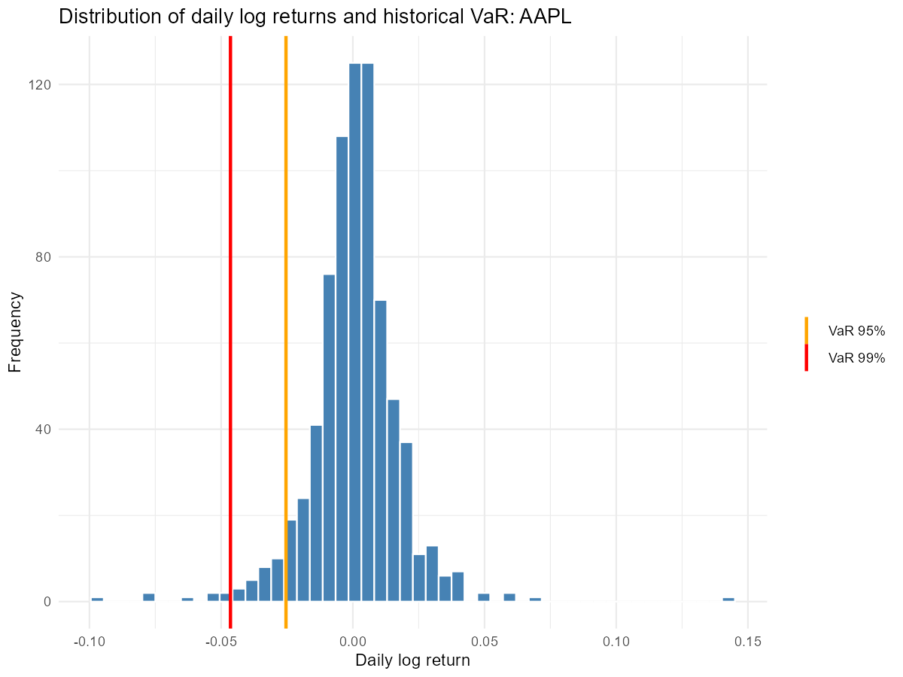
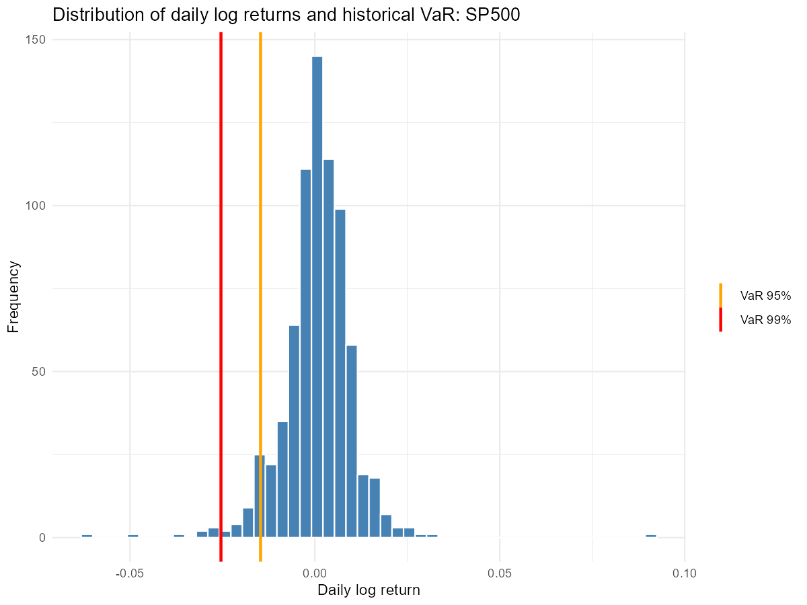

# risk-management-hw1

Practical assignment: Value at Risk (VaR) and Expected Shortfall (ES) in R.

## Project structure

- `scripts/main_analysis.R` – R script: data download, log returns, risk metrics, charts
- `data/` – output files: `risk_results.csv` and histograms with VaR lines (`var_chart_AAPL.png`, `var_chart_SP500.png`)

## Data and method

Daily adjusted close prices of Apple (AAPL) and the S&P 500 index (^GSPC) from Yahoo Finance for the last three years (Sept 2023 – Sept 2026). Daily log returns were computed and missing values removed. VaR was estimated with the historical and the parametric (Gaussian) methods; ES with the historical method.

## Results (daily, % of position value)

| Asset | VaR 95% Historical | VaR 99% Historical | VaR 95% Parametric | VaR 99% Parametric | ES 95% Historical |
|-------|-------------------:|-------------------:|-------------------:|-------------------:|------------------:|
| AAPL  | 2.54 | 4.65 | 2.67 | 3.82 | 3.91 |
| S&P 500 | 1.47 | 2.54 | 1.47 | 2.12 | 2.14 |

## Conclusions

- With 95% confidence, the daily loss on AAPL should not exceed about 2.5%, versus about 1.5% for the S&P 500, so AAPL is roughly 1.7 times riskier than the index.
- At the 95% level, the historical and parametric VaR are close. At the 99% level, historical VaR is clearly higher (AAPL: 4.65% vs 3.82%), because real returns have fat tails that the normal distribution underestimates.
- Expected Shortfall is larger than VaR 95%: on the worst 5% of days, the average loss is about 3.9% for AAPL and 2.1% for the S&P 500.

